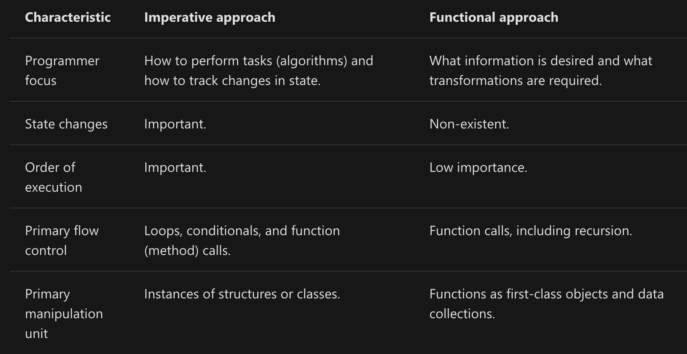

## Functional Programming vs. Imperative Programming

The functional programming paradigm was explicitly created to support a pure functional approach to problem solving. `Functional` programming is a form of `declarative` programming. In contrast, most mainstream languages, including object-oriented programming (OOP) languages such as C#, Visual Basic, C++, and Java, were designed to primarily support `imperative` (`procedural`) programming.

### Example of Fibonacci

**Imperative/Procedural Approach in PYTHON**

```
def fib(n): 
    if n==1: 
        return 0
    elif n==2: 
        return 1
    else: 
        return fib(n-1)+fib(n-2) 
```

**Declarative/Functional Approach in ELIXIR**
```
def fib(0), do: 0
def fib(1), do: 1
def fib(n), do: fib(n-1) + fib(n-2)
```

With an `imperative` approach, a developer writes code that describes in exacting detail the steps that the computer must take to accomplish the goal. This is sometimes referred to as algorithmic programming. In contrast, a `functional` approach involves composing the problem as a set of functions to be executed. You define carefully the input to each function, and what each function returns. The following table describes some of the general differences between these two approaches.

<table><tr><td>

</td></tr></table>

Although most languages were designed to support a specific programming paradigm, many general languages are flexible enough to support multiple paradigms. For example, most languages that contain function pointers can be used to credibly support functional programming. Furthermore, C# includes explicit language extensions to support functional programming, including lambda expressions and type inference. LINQ technology is a form of declarative, functional programming.

_Functional is focused on WHAT, imperative is focused on HOW._

## Functional - Pure Functions (No side-effects)
When you write code using a `functional` style, your functions are designed to have no side effects: instead, they take an input and produce an output without keeping state or modifying anything not reflected in the return value. Functions that follow this ideal are referred to as `purely functional`.


### Advantages of Pure Functions

The primary reason to implement functional transformations as pure functions is that pure functions are composable: that is, self-contained and stateless. These characteristics bring a number of benefits, including the following:

* **Increased readability and maintainability**
  
  This is because each function is designed to accomplish a specific task given its arguments. The function does not rely on any external state.

* **Easier reiterative development**
  
  Because the code is easier to refactor, changes to design are often easier to implement. For example, suppose you write a complicated transformation, and then realize that some code is repeated several times in the transformation. If you refactor through a pure method, you can call your pure method at will without worrying about side effects.

* **Easier testing and debugging**
  
  Because pure functions can more easily be tested in isolation, you can write test code that calls the pure function with typical values, valid edge cases, and invalid edge cases.

## Idempotence
Idempotence
Idempotence is a property of certain operations/functions. A function is idempotent if and only if the result of applying it twice is the same as the result of applying it once, i.e., if you apply f again to the result of f(x) you will get the same result again. This can be translated into:

`∀x f(f(x)) = f(x)`

For instance, sorting a list is idempotent, as sorting it a second time has no effect.