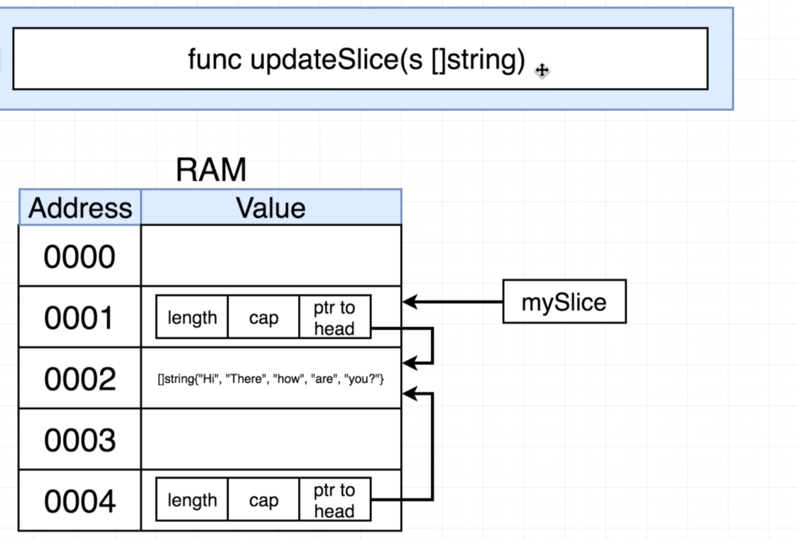
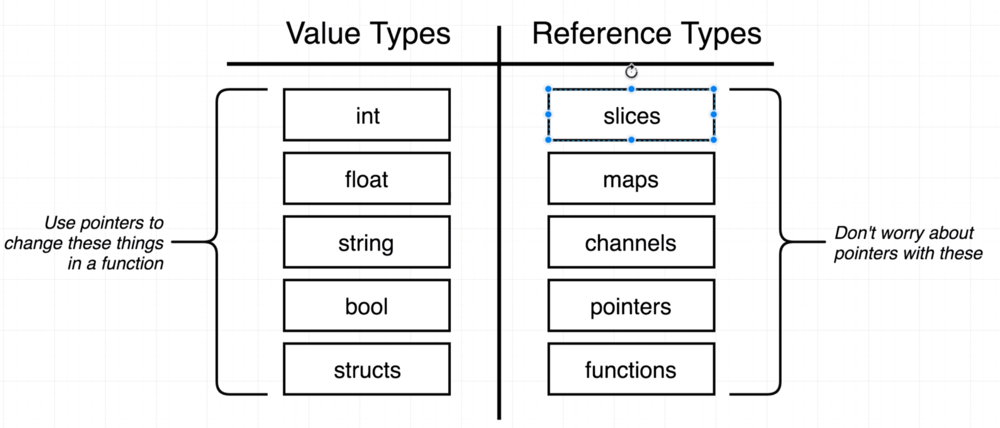
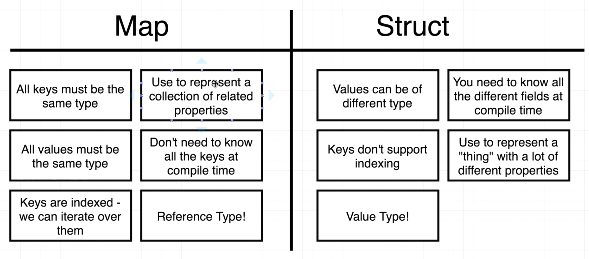
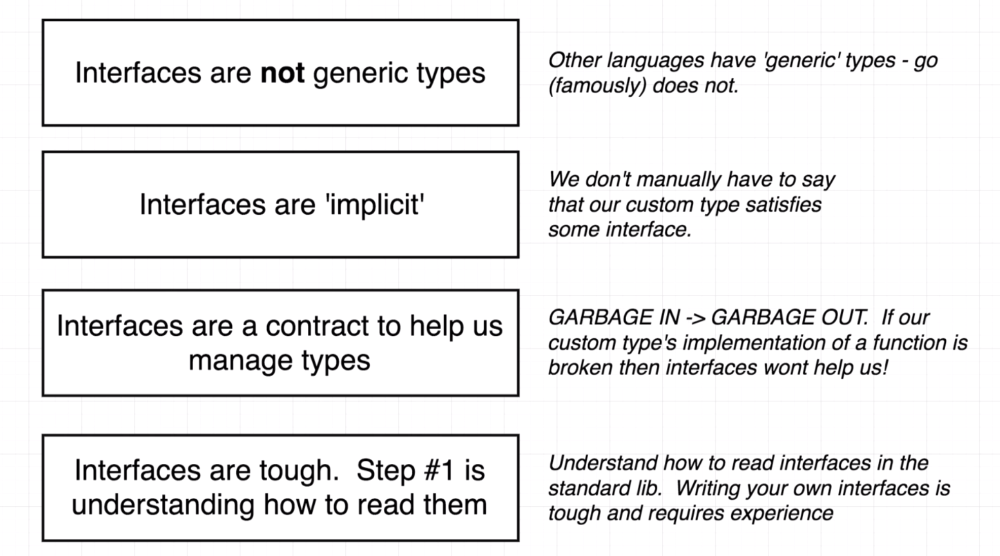
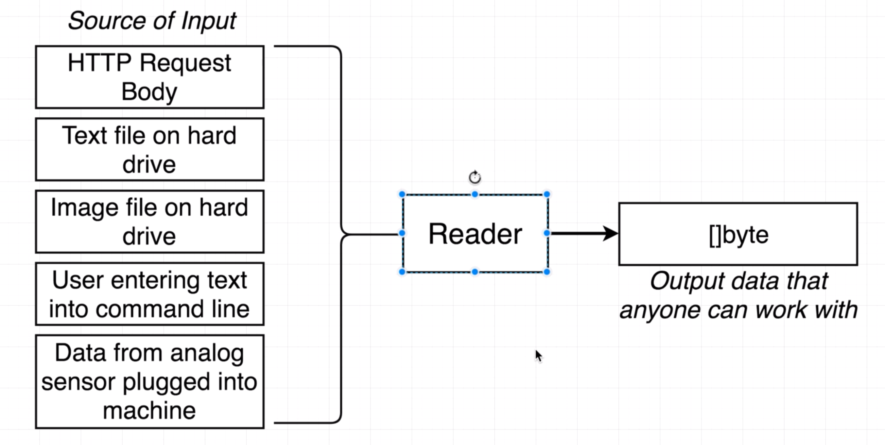
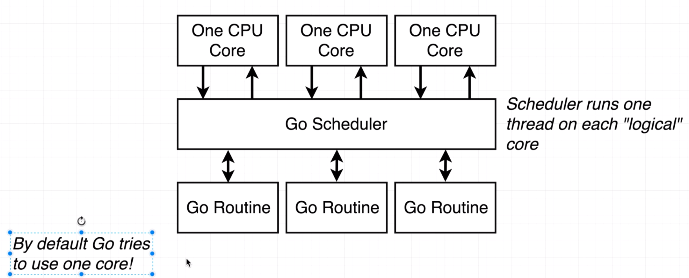
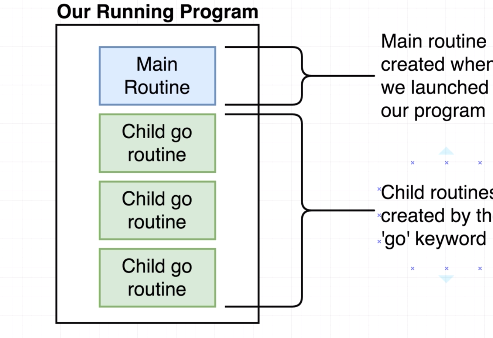
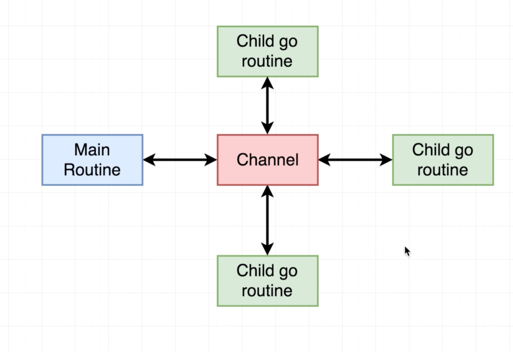
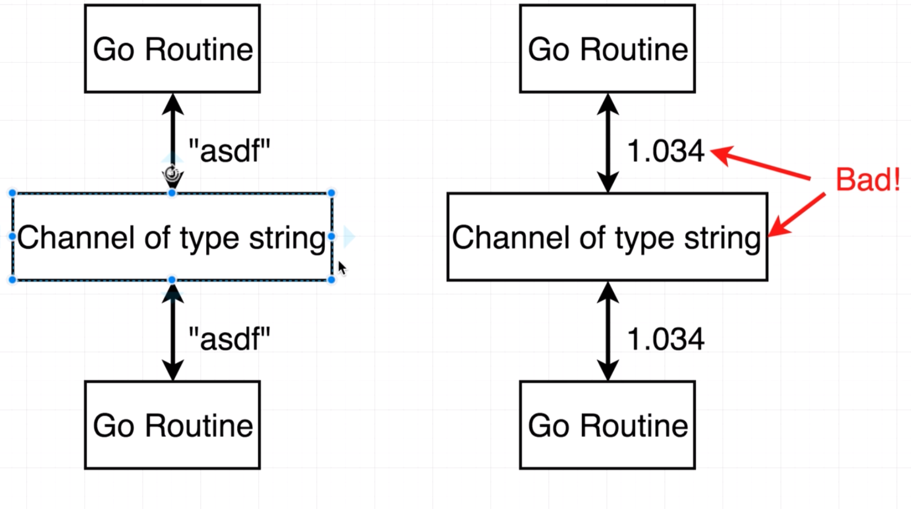

# Go - Idioms & Best Practices

## A few characteristics

* Created by Robert Griesemer, Rob Pike, and Ken Thompson at Google by 2009. It is open source, so anybody can contribute to it and propose new features.
* Goal was to make Google’s software engineers lives easier, as an alternative to C++. It is targeted to systems programming, such as cloud systems, distributed systems and microservices.
* Go code is compiled very fast! This is one of the key aspects that the creators tried to improve regarding C and C++, and they did!
* Golang is a multi paradigm programming language. It has aspects of object-orientation (structs), procedural and functional programming.
* Golang is not a functional language but have a lot of features that enables us to applies functional principles in the development, turning our code more elegant, concise, maintanable, easier to understand and test.


* Statically typed language (see [Statically vs Dynamically Typed Languages](https://android.jlelse.eu/magic-lies-here-statically-typed-vs-dynamically-typed-languages-d151c7f95e2b))
  * A language is dynamically-typed if the type of a variable is checked during run-time. 
  * A language is statically-typed if the type of a variable is known at compile-time instead of at run-time. 
* Pass-by-Value language
  * By definition, pass by value means you are making a copy in memory of the actual parameter's value that is passed in, a copy of the contents of the actual parameter. 
  Use pass by value when when you are only "using" (READ-ONLY) the parameter for some computation, not changing it for the client program.
  * In pass by reference (also called pass by address), a copy of the address of the actual parameter is stored. 
  Use pass by reference when you are CHANGING (UPDATE) the parameter passed in by the client program.
  * So **Go** is by default copying the parameters in functions. BUT, it wouldn't be fun if there are no exceptions ;-). So there are exceptions (see "value-types" vs. reference-types") !!! https://drive.google.com/file/d/1ENMX7ASI7FPl54VKh0xF6Zk1lNT__5Nh/view
  
* Garbage collection

  * Different to C++ where you always manually have to delete whenever you allocate an object (new/delete idiom in C++)
* Go supports built-in concurrency (see `channels`) 

Documentation https://golang.org

## Core Feature Overview

- Reference & Value types
- Pointers
- structs & Receiver Functions (Go pendant to member function in OO)
- Interfaces (2 meanings)
- Channels for concurrency

## From OO Aproach to Go Approach

* Custom type-definition (like classes in OO languages), in go you define your own types by `type` keyword. 
    * For example a `type` of `struct` or `type` of `interface`. 
* `struct` is a typed collection of fields. They’re useful for grouping data together to form records.
* Receiver function which can receive a certain type of variable
* More about `interfaces` later! 

## Receiver Functions

By a *Receiver Function* we assign a function to variables (structs). You can say that the function "belongs" to the struct. Or the function can "receive" this specific type of struct. See following example :

```go
package main

import "fmt"

type person struct {
	name string
	age int
}

func (p person) print() {
	fmt.Printf("%s is of %d years \n", p.name, p.age)
}

func main() {
	alex := person{
		name: "Alex",
		age: 41,
	}
	alex.print()
}
```
If you notice the print function, it is a little unusual. Unlike other languages, in go we have a parameter list before the function name.
This parameter (p of type person in the example) is what makes the print() function a receiver function. More precisely, the print() function is a function which can receive a person.

Note: So plain type as map or slice cannot be defined as a receiver. That's why you
need to wrap these types in a `struct`.

### Benefits
* The person type has no knowledge of the receiver
* Works well with 'interfaces' (see later)

### Receiver vs Function Argument

When to use receiver or function argument, read this: [Golang Receiver vs Function Argument](https://grisha.org/blog/2016/09/22/golang-receiver-vs-function/)

## Multiple Return Values

Return values are listed in the end of the functions signature. When you have more than one return value, you have to use brackets.

```go
func delete() (string, error) {
  ...
}
// calling the function
info, err := delete()
```

## Unused variables with "_"

The Go compiler throws an error in case you don't use a variable you have defined. But sometimes you don't need a variable. Then you can use the `_` (underscore) which states that you don't use the variable and the compiler is happy:

```go
func save() (string, error) {
  ...
}
_, err := save() // I do not care about the returned string
```

## Slices

`sliceName[startIndexIncluding:upToNotIncludingIndex]`

i.e. slice[0:2] - give me index[0] and index[1] BUT NOT index[2]
=> 0 can be left out since Go would automatically assume the 0 index
i.e. slice[:2]
Same goes for end index!

## Public / Private Functions

A package is the smallest unit of private encap­sulation in Go.

- All identifiers defined within a package are visible throughout that package.
- When importing a package you can access only its **exported** identifiers.
- An identifier (variable/function) is exported if it begins with a **capital letter**.

```go
type Request struct {
	 Message string   // variable Message is public - accessible for other packages
   code    int32    // variable code is private - accessible only within the package
}
```

## Type Conversion
Many interfaces in Go work with slice-of-bytes ([]byte). So we need to convert
our specific values:

```go
greeting := "Hello World!"
[]byte(greeting)
```


## Error Handling

Common Go pattern is:

```go
result, error := someFunctionCanThrowAnError()
if error != nil {
// logit or panic or exit or whatever
}
```

## Pointers and * & Operators

A pointer holds the memory address of a value.
As an analogy, a page number in a book's index could be considered a pointer to the corresponding page; dereferencing such a pointer would be done by flipping to the page with the given page number and reading the text found on that page. 


In Go a pointer is represented using the `*` (asterisk) character followed by the type of the stored value.
`*` is also used to dereference pointer variables. Dereferencing a pointer gives us access to the value the pointer points to.

The `&` operator generates a pointer to its operand.

1. To turn an address into a value then use `*address`
2. To turn a value into an address then use `&value`

### Question / Answer about Pointers

**Question**: Whenever you have a pointer in the receiver of a function (see snippet), what does that say to us?
```go
func (p *person) updateName(newFirstName string) {
```
> **Answer**: It specifies the type of the receiver that the function expetcs. It is NOT turning the pointer address into a value (no dereferencing here!!!).

**Question**: Whenever you pass an integer, float, string, or struct into a function, what does Go do with that argument?

> **Answer**: It creates a copy of each argument, and these copies are used inside of the function.

**Question**: What is the &  operator used for?
> **Answer**: Turning a value into a pointer.

**Question**: When you see a `*` operator in front of a pointer, what will it turn the pointer into?
> **Answer**: A value.

**Question**: Take a look at the following program.  The changeLatitude function expects a receiver of type pointer to a location struct, but in the main function the receiver is a value type of a struct.  What will happen when this code is executed?

```go
package main
 
import "fmt"
 
type location struct {
 longitude float64
 latitude float64
}
 
func main() {
 newYork := location{
   latitude: 40.73,
   longitude: -73.93,
 }
 
 newYork.changeLatitude()
 
 fmt.Println(newYork)
}
 
func (lo *location) changeLatitude() {
   lo.latitude = 41.0
}

```
> **Answer**: This program uses a shortcut, where Go will automatically assume even though ``` newYork.changeLatitude() ``` is using a value type we probably meant to pass in a pointer to the ```newYork``` struct.

**Question**: Here's a tricky one!  What will the following program print out?

```go
package main
 
import "fmt"
 
func main() {
    name := "Bill"
    fmt.Println(*&name)
}

```
> **Answer**: The string "Bill".

**Question** What will the main() function print out?
```go
package main

import (
	"fmt"
)

func main() {
	mySlice := []string{"Hi", "There"}
	updateSlice(mySlice)
	fmt.Println(mySlice)
}

func updateSlice(s []string){
    s[0] = "Bye"
}
```

> **Answer**: "Bye There".

WHY IS THE SLICE NOT COPIED HERE?

It's not like passing a `struct` which would be copied. slices (and other types) are special kind of types and are handled differently in memory by Go.

A ```slice``` in Go consists of a pointer to the head of an array, the capacity of the array and the length of the array. These metadata of the slice are stored in a separate register address. So when we call a function with a slice then Go creates a copy (call-by-value) of the slice metadata in memory, not a copy of the referenced array. See image below:

<table><tr><td>

</td></tr></table>


In Go we refer to these kind of types as "**reference types**" which all have this behaviour. All other types, which will be copied (call-by-value), are called "**value types**".

Below an overview of all "**reference types**" and "**value types**":
<table><tr><td>

</td></tr></table>

## struct vs. map

<table><tr><td>

</td></tr></table>


* Over a `struct` we cannot iterate!
* `map` is a more dynamic data type. It can grow or shrink at runtime. In opposite the `struct` has always the same attributes, so its a more static data type.

## Interfaces 

See [Polymorphism with Interfaces](https://medium.com/technofunnel/polymorphism-with-golang-interfaces-b2f58a05b221)

1. Interfaces define the functional contract  (like in Java with methods to implement)
2. Interfaces are Types in Golang


<table><tr><td>

</td></tr></table>


### Composition of Interfaces

We can create an interface which has includes multiple other interfaces:

```go
type ReadCloser interface {
      Reader // is also an interface
      Closer  // is also an interface
}
```
OR 
```go
type ReadSeeker interface {
      Reader // is also an interface
      Seeker // is also an interface
}
```

### Sample of Reader-Interface

You have different types of input and Reader-Interface converts it to same aggregated common output, here `[]byte` (slice of bytes). 

<table><tr><td>

</td></tr></table>

This is the signature of the `Reader` interface:

```go
type Reader interface {
     Read (p []byte) (n int, err error)
}
```
Since `p []byte` is a slice of bytes, remember slice is a reference type, the original slice will be used in the `Read` function. That's why this signature has no extra argument of the slice.


### Test questions about interfaces

**Question**: In the following code, does the `square` type satisfy the `shape` interface?

```go
type shape interface {
    area() int
}
 
type square struct {
    sideLength int
}
 
func (s square) area() int {
    return s.sideLength * s.sideLength
}
 
func printArea(s shape) {
    fmt.Println(s.area())
}

```
> **Answer**: Yes, because `square` defines the `area` function that returns an `int`.

**Question**: Does the `rectangle` type satisfy the `shape` interface?
```go
type shape interface {
    area() int
}
 
type square struct {
    sideLength int
}
 
type rectangle struct {
    height float64
    width float64
}
 
func (s square) area() int {
    return s.sideLength * s.sideLength
}
 
func (r rectangle) area() float64 {
    return r.height * r.width
}
 
func printArea(s shape) {
    fmt.Println(s.area())
}
```
> **Answer**: No, because the rectangle's version of the `area` function returns a `float64`, but the `shape` interface expects a return type of `int`.

**Question**: Type square appears to successfully implement the shape interface, but the implementation of square 's area function looks broken - it always returns a value of 10 no matter what the side length of the square is.  Will the shape  interface do anything to help us catch this error?

```go
type shape interface {
    area() int
}
 
type square struct {
    sideLength int
}
 
func (s square) area() int {
    return 10
}
 
func printArea(s shape) {
    fmt.Println(s.area())
}
```
> **Answer**: No, interfaces are only used to help with types. We can still easily code that does something completely wrong.

**Question**: Imagine that you ask a coworker to create a new type that implements the Reader  interface to take data from a text file and print it on the screen.  They present you with the following code:

```go
type textFileReader struct {}
 
func (textFileReader) Read(bs []byte) (int, error) {
    return "Information from a text file"
}
```
What would you say?

> **Answer**: I'd say that while the `testFileReader` type conforms to the requirements of the `Reader` interface, it doesn't actually implement the desired behaviour of reading a file from the hard drive.


## Go-Routines and Channels

Execution logic for go routines with one CPU:

<table><tr><td>

</td></tr></table>

Execution logic for go routines with multiple CPUs:

<table><tr><td>

</td></tr></table>

This is truly executed in parallel!

What's happening when working with go routines:

<table><tr><td>

</td></tr></table>

To communicate between go routines we use _channels_.

<table><tr><td>

</td></tr></table>

Channels are typed:

<table><tr><td>

</td></tr></table>

